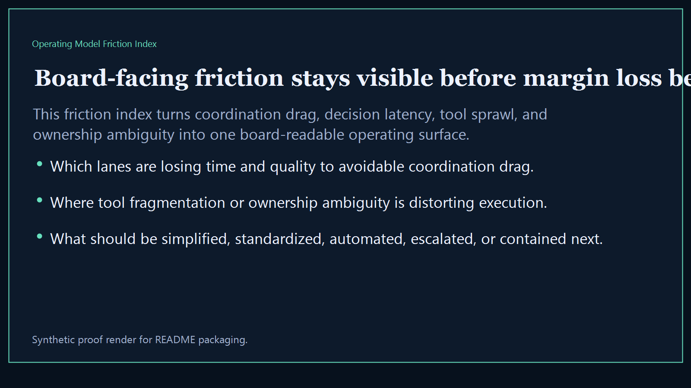
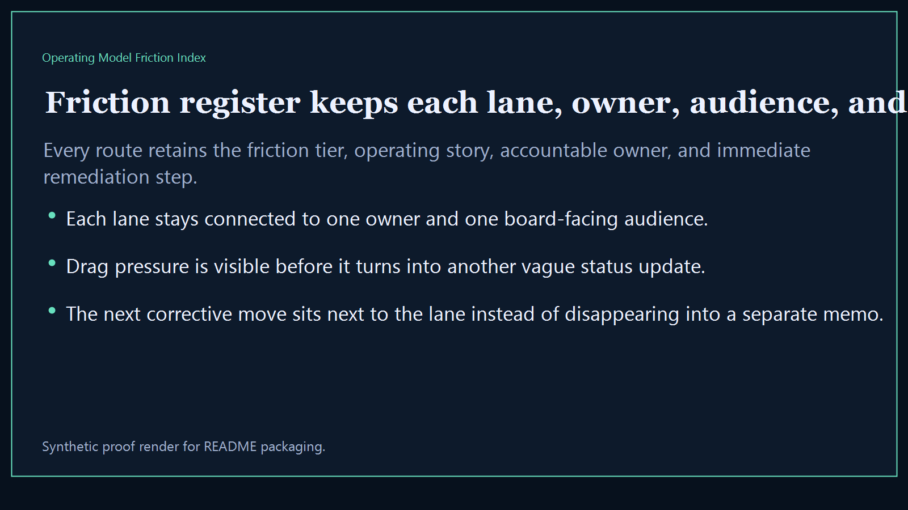
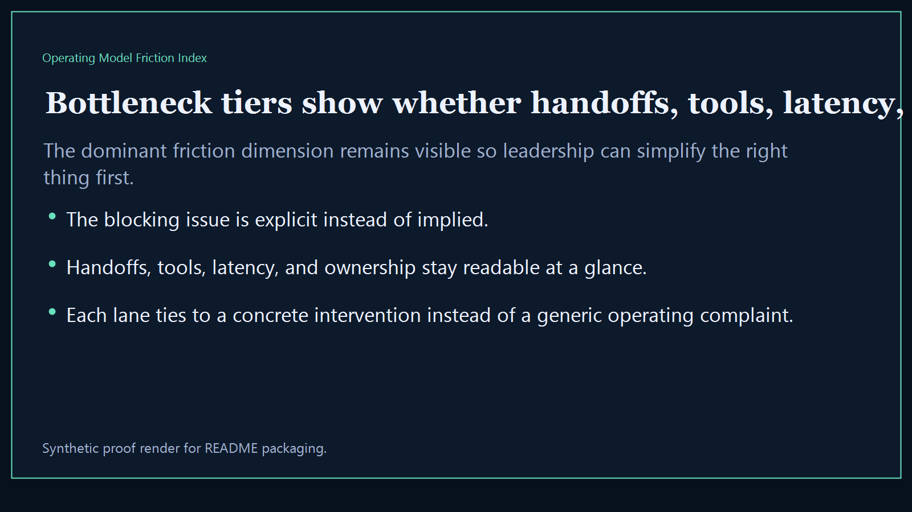
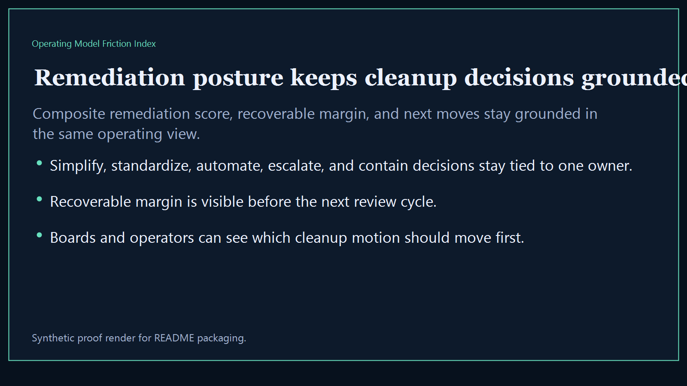

# Operating Model Friction Index

Board-ready executive-intelligence surface for exposing operating-model friction, coordination drag, and decision overhead across the broader Kinetic Gain suite.

- Live: `https://friction.kineticgain.com/`
- Repo: `mizcausevic-dev/operating-model-friction-index`

## Why this matters

Leaders need one friction index that shows where work is getting stuck, where coordination overhead is eroding margin, and which operating-model issues deserve intervention before the next board or investor review.

## What it includes

- TypeScript executive-intelligence surface for tracking coordination drag, decision latency, and operating-model friction
- synthetic lanes across multiple sectors, owner groups, and board-visible friction dimensions
- reusable outputs for friction register, bottleneck tiers, remediation posture, and board-ready operating narratives
- prerendered static site, JSON payloads, screenshots, and docs

## Routes

- `/`
- `/friction-register`
- `/bottleneck-tiers`
- `/remediation-posture`
- `/verification`
- `/docs`

## Local run

```bash
cd operating-model-friction-index
npm install
npm run verify
npm run prerender
npm run render:assets
```

## CLI

```bash
npx operating-model-friction-index fixtures/operating-model-friction-index.json --format summary
npx operating-model-friction-index fixtures/operating-model-friction-index-clean.json --format json
```

## Docs

- [Architecture](docs/architecture.md)
- [Origin](docs/ORIGIN.md)
- [Kinetic Gain Embedded](docs/KINETIC_GAIN_EMBEDDED.md)

## Screenshots





